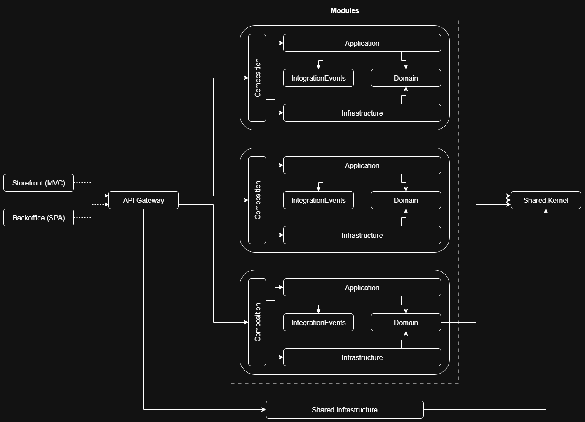

# DepresStore

> [!NOTE]
> This is not a real ecommerce system but an experimental project for learning purposes where I try to apply DDD, CQRS and experiment with the modular monolith architecture. Some business rules could be made up.

## Architecture Overview

**_Work In Progress_**

## Project Structure Overview

Since this is a solo project both front-end and back-end are put in the same repo (monorepo). Instead of using folders like `frontend` and `backend`, I decided to use `client` for the client-side stuff (SPAs) and `server` for the server-side stuff (which includes both the back-end system and the customer-facing web app because it's server-side rendered).

Here's a general overview of the project structure:

Each solid arrow represents a dependency (a project reference). The dashed arrows are just for indicating that the web applications consume the REST API endpoints exposed by `WebApi`.
